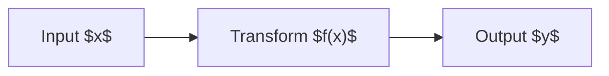

<!-- _class: lead -->

# Marp Fragile Structure Sample

This deck collects layout cases that are easy to break in Marp preview.

---

# Default CSS Check

Expected:

- Heading, strong text, and links use the purple accent.
- `inline code` and code blocks use the pale purple surface.
- Custom CSS such as `section h1 { color: red; }` can override this slide.

```ts
const deck = "marp";
console.log(deck.toUpperCase());
```

---

# Long Text Overflow

Marp slides have fixed dimensions, so long prose overflows more easily than regular Markdown preview.

super-long-token-without-natural-breakpoints-super-long-token-without-natural-breakpoints-super-long-token-without-natural-breakpoints

> Blockquotes also consume vertical space because of padding, background, and border styles.

---

# Dense Table

| Case | Risk | Expected |
| --- | --- | --- |
| Wide header | Not enough width | Cell content stays inside the slide |
| Many rows | Not enough height | Footer and pagination remain visible |
| Long token | Cannot wrap | Preview does not require horizontal scrolling |
| Code | `veryLongIdentifierNameWithoutBreakpoints` | Code background remains visible |
| Mixed | **bold** / [link](https://example.com) | Accent styling remains visible |

---

# Two Columns With Raw HTML

<div style="display:grid; grid-template-columns:1fr 1fr; gap:32px;">
<div>

## Left

- Markdown inside raw HTML
- list item
- list item

</div>
<div>

## Right

```js
function fragile(value) {
  return value.repeat(8);
}
```

</div>
</div>

---

# Image And Caption


Images exercise asset path rewriting and slide scaling. Missing or very large images should not break the controls or stage.

---

<!-- _class: invert -->

# Invert Class

`<!-- _class: invert -->` should switch background, text color, and accent variables.

- heading
- list item
- `code`

---

# Mermaid And Math



$$
\sum_{i=1}^{n} i = \frac{n(n+1)}{2}
$$

---

# Background Directive


Background directives are handled differently from normal images. Theme CSS should not erase the background layer.

---

# Final Checklist

- Slide navigation works.
- Overview mode keeps per-slide styling.
- PDF export mode hides controls.
- Custom CSS can still override Marp sections.
